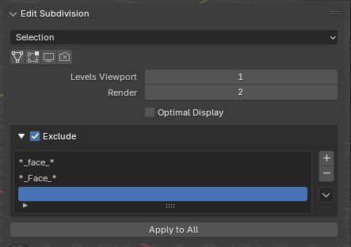
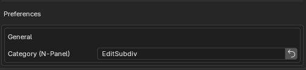

# Edit Subdivision

Blender 4.2+ 拡張機能。3D ビューポートの N-Panel から、選択オブジェクト（または シーン全体）の **Subdivision Surface（SUBSURF）モディファイア設定をまとめて変更**します。

オブジェクトごとにモディファイアを開いて設定し直す手間を省き、表示/レンダーの切替やレベル変更を一括で行うことが目的です。

## 主な特徴

- 対象を **Selection（選択オブジェクト）/ Scene（シーン全体）** から選択
- Modifier ヘッダと同じ4トグルを一括切替
  - **On Cage**（`show_on_cage`）
  - **Edit Mode**（`show_in_editmode`）
  - **Realtime / Viewport**（`show_viewport`）
  - **Render**（`show_render`）
- **Levels Viewport / Render**（`levels` / `render_levels`、0〜6）
- **Optimal Display**（`show_only_control_edges`）
- **ライブ更新**: パネルで値を変えた瞬間に対象の全 SUBSURF へ即適用
- **Apply to All**: 現在のパネル設定一式を、いまの対象へ一括で再適用（選択を切り替えた後にまとめて流し込むときに便利）
- **Exclude フィルタ**: 名前パターンに一致するオブジェクトを処理対象から除外（詳細は下記）

## 使い方

1. 3D ビューポートで N キーを押し、サイドバーの **EditSubdiv** タブを開く
2. 対象（Selection / Scene）を選ぶ
3. 各トグル・レベル・Optimal Display を操作すると、対象の SUBSURF モディファイアへ即時反映
4. 選択を変えて同じ設定を流し込みたいときは **Apply to All** を押す

## Exclude（処理対象の除外）

特定のオブジェクトを一括変更の対象から外せます。リギング用の補助メッシュなど、SUBSURF を触りたくないオブジェクトを名前で弾く用途を想定しています。

1. **Exclude** のチェックを ON にする
2. リスト右の `+` でパターン行を追加し、オブジェクト名のパターンを入力（`-` で選択行を削除）
3. いずれかのパターンに一致したオブジェクトは、ライブ更新・Apply to All の対象から除外される

- パターンはワイルドカード（glob）。例: `*_face_*`（名前に `_face_` を含む）、`Hair*`（`Hair` で始まる）
- 複数行は **OR**（どれか1つに一致すれば除外）
- **大文字小文字を区別**します（`*_face_*` と `*_Face_*` は別パターン）
- チェックを外すと、行を残したままフィルタだけ無効化
- リスト右下の `▼` メニューから、パターン一覧をテキストファイルへ **Export** / テキストファイルから **Import** できます（1 行 1 パターン、`#` から始まる行はコメント。Import は既存リストを置換）

> 注: Exclude は「以後の書き込みを止める」フィルタです。既に適用済みの値を、後から Exclude を追加して遡って戻すことはしません。

## 設定（Preferences）

N-Panel のタブ名（`bl_category`）は Preferences から変更できます（既定: `EditSubdiv`）。リセットボタンで既定値へ戻せます。

## インストール

1. リリース zip を Blender へドラッグ＆ドロップ、または Edit > Preferences > Get Extensions > Install from Disk
2. Blender 4.2 以上で動作確認

## ライセンス

GPL-3.0-or-later
